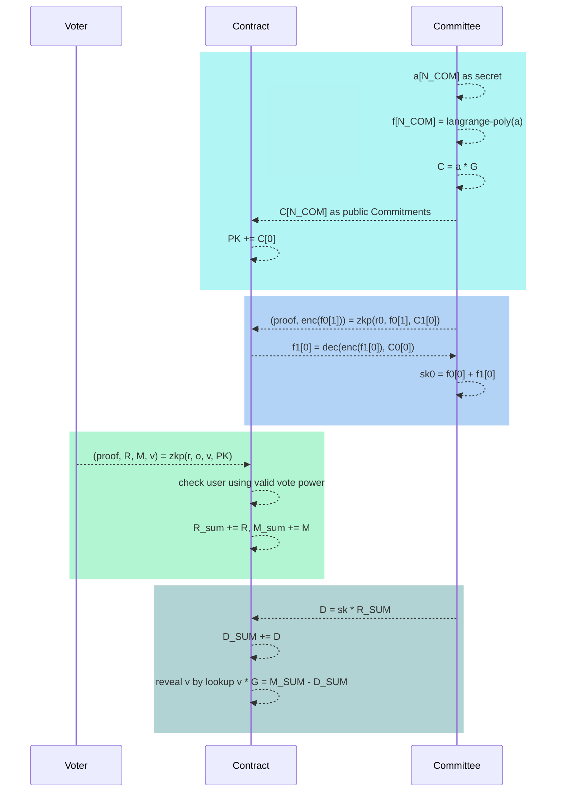

# DeFROST: Poseidon 🤝 ⌐◨-◨

## Team

**DigitalOil.nftr** is a 2x Nouner. 
*Background*: B.S. EE @ Georgia Tech, S.M. EECS @ MIT.
*Pre-Crypto*: Researcher @ MIT Retinal Implant Project, Satellite Communications engineer, iOS developer, Logistics conglomerate owner.
Crypto: Investor since 2014. Founder of [NFTR](https://nftr.name),  building Nouns (Props [199](https://nouns.wtf/vote/199), [241](https://nouns.wtf/vote/241), [The Panama DAO](https://prop.house/builder/dao-incubator-round-2/3300) -- winner of Nouns Builder Incubator), focus on ZK.

**Shumo Chu** is a Nouner.
*Background*: Ph.D. CS @ University of Washington.
*Crypto*: Core contributor of [Poseidon](https://pdn.xyz/) and [Manta](https://www.manta.network/), ex-Research Scientist [Algorand](https://www.algorand.com/).
*Academic*: ex-Assistant Professor at UCSB CS. Author of [ZEN](https://eprint.iacr.org/2021/087), one of the first ZKML papers (major technique was adopted by [WorldCoin](https://fc21.ifca.ai/index.php)), has published papers in major cryptographic conferences such as [ITC](https://itcrypto.github.io/2021/), [Financial Cryptography](https://fc21.ifca.ai/index.php).  

**Brandon H. Gomes**
*Background*: Bachelor Physics and Math @ Rutgers University
*Crypto*: Core Contributor of [Poseidon](https://pdn.xyz) and [Manta](https://www.manta.network) and creator of [OpenZL](https://openzl.org)

**Boyuan Feng**
*Background*: Ph.D. CS @ University of California, Santa Barbara
*Crypto*: Core Contributor of [Poseidon](https://pdn.xyz) and [Manta](https://www.manta.network) and architect of [ZPrize](https://www.zprize.io/prizes/accelerating-elliptic-curve-operations-and-finite-field-arithmetic-wasm). Author of [ZEN](https://eprint.iacr.org/2021/087), one of the first ZKML papers, and [zkShuffle](https://hackmd.io/xj--HI7sTl2T3fbK1NONtQ) for enabling fully-onchain poker games.

**Lucy Qiu**
*Background*: Bachelor CS @ Rutgers University 
*Crypto*: Twice Eth Hackathon Sponsor Prizes Winner including top prizes from The Graph, Push Protocol, OP, Gnosis Chain, Covalent. 

**Sam Hu** 
*Background*: B.S. CS @ Tianjin University, S.M. CS @ Fudan University.
*Pre-Crypto*: Maintainer @ Linux Kernel Network, Compiler Engineer, Hardware Designer.
*Crypto*: Building IEEE 802.11i for wireless chip, Four zk-based projects from scratch including spot/perpetual zk-rollup dexs and zk-privacy social/gaming.

*[DigitalOil](https://twitter.com/0xDigitalOil) and [Poseidon](https://pdn.xyz) come together for this proposal, merging good understanding of the Nouns ecosystem, culture and its necessities with a cutting-edge ZK research team.*

## Poseidon Prior Work

[Poseidon](https://pdn.xyz/)'s vision is to democratize zkDapps on Ethereum. Poseidon enables developers to build scalable zkDapps using pure solidity by leveraging our zkContract, SDKs, and ZK-ZK Rollup. Poseidon has partnered with [Consensys zkEVM](https://goerli.zkevm.consensys.net/explore) and [Cysic](https://cysic.xyz/) to build the next generation ZK Layer 3 where allows developers building zkDApp on EVM 

The most relevant project to this proposal is our ZK Vote Demo App powered by Poseidon's zkContract and [semaphore](https://semaphore.appliedzkp.org/). 

This demo is deployed on Optimism Goerli / Consensys zkEVM Goerli:
* Dapp: https://www.zkvote.app/
* Demo video: https://www.youtube.com/watch?v=cS_YX8UHk74&t=1s
* Code: 
    * Frontend: https://github.com/Poseidon-ZKP/zkVote-web
    * Contract: https://github.com/Poseidon-ZKP/zkvote-contract
    * Snap/Prover: https://github.com/Poseidon-ZKP/zkVote-snap
    * Subgraph: https://github.com/Poseidon-ZKP/zkvote-subgraph
    * Relayer: https://github.com/Poseidon-ZKP/zkvote-relayer 

Note that the demo above is nearly compliant with the [requirements](https://hackmd.io/SVyDLBq7QSWNl0LaYIuqHA?view) for this round. The main issues with the scheme are: 1. It doesn't allow keeping voting power secret; 2. It isn't multisig friendly. For these reasons we have designed a custom scheme that complies with all specs. Our scheme is presented below.

## Background

### Which properties of Nouns DAO voting are currently public?

1. Voter's address
2. Voter's ballot (vote & voting weight). 
 
We define voting weight as:

$$v_i = \# \text{ owned nouns} + \# \text{ delegated nouns} $$

As a result, there are 3 ways to make voting private:
1. Hide voter's address
2. Encrypt voter's ballot
3. Hide both

## Design Tradeoffs

### Hiding Voter's Address
To hide a voter's address, the voting scheme must validate the voter's eligibity as well as prevent double voting. There are currently two schemes that allow for this:
1. [Semaphore](https://semaphore.appliedzkp.org/): Semaphore is a protocol designed by Ethereum Foundation's Privacy & Scaling Explorations group. It combines a private identity group (anonymity set) with a nullifier scheme. 
2. [ECDSA ZKP](https://github.com/0xPARC/circom-ecdsa) + [Deterministic Nullifers](https://github.com/zk-nullifier-sig/zk-nullifier-sig): Semaphore requires keeping an extra secret and private identity in addition to the user's Ethereum private key. This scheme solves provides an alternative solution by directly generating a ZKP of the voter's Ethereum account combined with a ZK nullifier based on a deterministic signature scheme over ECDSA. Despite solving for lower user friction, existing ECDSA ZKP and ZK nullifier implementations are far from practical due to the burden of expensive non-native arithmetics (secp). For example, the most efficient ECDSA proof on a native Ethereum curve requires a ~1GB proving key and has a 45 sec proof generation time on a 16-core 3.0GHz, 32G RAM machine (AWS c5.4xlarge instance). There are more efficient ECDSA proofs on non-Ethereum native curves such as Spartan-ECDSA [[4](#Reference)]. However, to use Spartan-ECDSA, you would need to build a rollup scheme to transform the Spartan-ECDSA proof to a Groth16/Plonk Proof on Ethereum's native BN256 curve.

There are two common pitfalls with both schemes:
1. Hiding only addresses won't give the scheme a sound privacy guarantee. For example, if a Nounder holds a great number of Nouns, despite the voting address being hidden, an external observer can still infer their vote from their voting weight.
2. Both schemes cannot support nouns hold in smart contract wallets such as Gnosis SAFE well. Both scheme requires a explicit delegation from a smart contract account to either a EOA (ECDSA ZKP approach) or Semaphore Identity (Semaphore approach).

### Encrypting Ballots

The other design option is to encrypt the voting ballots. There are two challenges with designing a ballot encryption scheme for private voting:
1. The final vote tally should only disclose the aggregated voting result instead of individual votes.
2. The decryption/tallying should only happen after voting ends. For example, if the scheme reveals the aggregated result in "real time", then individual votes will still leak via the diff of two aggregated contiguous results.

### Our Design Choice

Our proposed scheme, called [DeFrost](#DeFrost-Design), solves these challenges by combining FROST [[1](#Reference)]'s distributed key generation (DKG) scheme and threshold homomorphic encryption (tHE) to encrypt ballots, but keeps the voting account public. The scheme is trustless in two senses:
1. The soundness of the scheme is guaranteed by the cryptographic construction.
2. The confidentiality of the ballots is guaranteed if no more than $t-1$ out of $n$ tally committee members collude.

The great benefit of encrypting ballots while keeping the voting account public is that it allows users to vote using their public account (i.e. EOAs or smart contract wallets). That is, this solution supports vote delegation and smart contract wallets such as Gnosis SAFE without introducing any user friction.

Nouns DAO governance currently depends heavily on delegation + a vast number of Nouns are held in smart contract wallets. Below is the onchain data at snapshot of block 16672087.

More than 15% of nouns are held in smart contract wallet, and more than 55% nouns holders delegate their voting power.

### Hiding both voting addresses and ballots

We could combine the approaches of [hiding voters' addresses](#Hiding-Voter's-Address) and [encrypting ballots](#Encrypting-Ballots). This would gain further privacy guarantees: not only the ballot is private, the fact that whether a user has voted or not is also hidden. However, it is debatable whether DAO governance requires this feature. For this reason, we believe it would introduce unnecessary friction.

## DeFrost Design

### Overview
This design has two types of participants: $n_{com}$ committee members  who hold a secret share to decrypt the ballots and $n_{user}$ users who cast votes (Nouns holders and delegates).

Committee members need to perform a one-time **Distributed Key Generation (DKG)** to setup $1$ shared public key $Pk$ and $n_{com}$ secret keys $sk_i$. The public key is public to all committee members and voters. Each secret key is owned by a committee member and used for the final vote on-chain tally.

Once users have the public key, they can use it for private voting with **Threshold Homomorphic Encryption**. Once the voting ends, we require $t$ out of $n_{com}$ commitee members to each submit an on-chain transaction.

### Distributed Key Generation by Committee

We use FROST [[1](#Reference)] for a two-round distributed key generation. This requires only commitee members to participate. It happens 1-time. The generated public key and secret keys could be reused. Before distributed key generation, $t$ is decided as the number of members required to participate during vote tally.

We consider the Baby JubJub curve $\mathbb{G}$, its scalar field $\mathbb{F}_r$, and a generator $G \in \mathbb{G}$. We use $a*b$ to denote multiplication on $\mathbb{F}_r$ and $a\cdot G$ for scalar multiplication on $\mathbb{G}$.

**Round 1**

- Each participant (committee member) $i$ samples $t$ random values $(a_{i,0}, \cdots, a_{i, t-1}) \leftarrow \mathbb{F}_r$ and uses these values as coefficients to define a degree $t-1$ polynomial $f_i(x) = \sum_{j=0}^{t-1}a_{i,j}*x^j$.
- Every participant computes a public commitment:
    - $\vec{C_i} = \langle C_{i,0}, \cdots, C_{i,t-1}\rangle$, where $C_{i,j} = a_{i,j}\cdot G, 0 \leq j \leq t-1$,

    and submits this public committment on-chain for the contract to verify that all points are on the Baby Jubjub curve. 

**Round 2**
- Each participant keeps $(i, f_i(i))$ as a secret
- Each participant $i$ posts every other $l$-th's participant's public key encrypted secret share $\texttt{ENC}(f_i(l), C_{l,0})$, and a ZKP to prove:
    -  $f_i(l) \cdot G = \sum_{k=0}^{t-1} l^k\cdot C_{i,k}$
    -  encryption is valid
- Each participant $i$ calculates their long-lived secret key by computing $sk_i = \sum_{l=1}^{n_{com}} f_l(i)$ and stores $sk_i$ securely.
- Each participant computes the public key $Pk = \sum_{i=1}^n C_{i,0}$ which is shared with all users.

As a result, each commitee member holds a secret key $sk_i \in \mathbb{F}_r$ and has a public key $Pk \in \mathbb{G}$ which voters will use when submitting their private votes on-chain.

> Note: An accumulated secret key $sk \in \mathbb{F}_r$ exists such that $Pk = sk \cdot G$. It could be used to decrypt private votings encrypted with $Pk$. This $sk$ remains unknown to individual commitee members. It could be revealed only if at least $t$ out of $n_{com}$ commitee members collude by sharing their secret key $sk_i$.

### Committee Process Flow

The committee setup process will be fully on-chain. A proposer will submit a proposal to the DAO that sets the following parameters in the committee contract: $n$, $t$, and committee member wallet addresses. To modify those parameters (i.e. do key rotation), a new prop would need to be submitted and pass.

The software required to run a committee "node" will be open-source and a GUI will be provided to facilitate key generation (for Round 1 & 2), submit the transaction for vote tally, as well as setting up a committee instance that performs these processes on AWS or similar. 

## Snapshot Voting Power

The governance contract takes a snapshot at the block number when the proposer submits the proposal on-chain. This snapshot stores a mapping between Ethereum addresses (could be either EOA or contract) and their corresponding voting power.

## Private Voting by Users

Users use the shared public key $Pk$ for private voting protected by ZKP and Threshold Homomorphic Encryption. 

During voting, users only need to send 1 message to the governance contract. Suppose each user has voting power $v_i$ according to the snapshot. In particular, a user $i$ samples a vector of random numbers $\vec{r_i} \in \mathbb{F_r}$ and calls the governance contract signing a transaction containing $(\vec{R_i}, \vec{M_i})$ + a ZKP such that:
- public input: $Pk$, $v_i$, $\vec{R_i}$, $\vec{M_i}$
- proving knowledge of $\vec{r_i}$ such that $\vec{R_i} = \vec{r_i} \cdot G$
- proving knowledge of vote $o_i$ in 1-hot encoding where $100$ means yes, $010$ means no, and $001$ means abstain. $M_{i,k}=(o_{i,k}*v_i)\cdot G + r_{i,k} \cdot Pk$, and $k$ is the index of the bit in the 1-hot encoded vote.

The contract receives the message and 
- verifies the proofs
- checks the account has not voted for the proposal before
- accumulates $\vec{R} = \sum_{i=1}^{n_{u}} \vec{R_{i}}$, $\vec{M} = \sum_{i=1}^{n_{u}} \vec{M_i}$

Denoting $\vec{r} = \sum_{i=1}^{n_{u}} \vec{r_i}, \vec{v} = \sum_{i=1}^{n_{u}} v_i * \vec{o_i}$, we have $\vec{R} = \vec{r}\cdot G \in \mathbb{G}$ and $\vec{M} = \vec{v}\cdot G + \vec{r}\cdot Pk  \in \mathbb{G}$. During vote tally, committee member will reveal $\vec{v}$ as the result.

> Note: Any number of users could participate in voting by using the same $Pk$.

#### Vote Delegation 

From the design, DeFROST support vote delegation by default. Since the addresses are public, DeFROST works exactly the same as the existing Nouns governance contracts.

#### Smart Contract Wallet

DeFROST supports smart contract wallets in a very straight forward manner: the smart contract sign the user generated enrypted vote. Take a 2/3 Gnosis SAFE multisig as an example, 3 members negotiate offchain about the voting result, and than they simply sign the encrypted vote using Gnosis SAFE like signing normal transactions.

#### Optionalities

DeFROST supports two kind of optionalities. First, it is obvious that not every member have to vote.

Second, Governance contracts can use DeFROST to build optional private vote very easily thanks to the enrypting ballots design. One can simply create two type of vote, public vote and encrypted vote. They gets tallyed seperately. In the end, the results 

## Vote Tally by Committee Members

Vote tally requires only $t$ out of $n_{com}$ committee members to participate, denoted as $I\subset \{1,2,\cdots, n_{com}\}$. Committee members communicate with the governance contract and do not require secure p2p communication channels.

During vote tally, each committee member queries $\vec{R}$ from the contract and sends a message $(i, \vec{D_i})$ to the contract along with a ZKP proving that decryption valid and generate sk correctly:

- $f_l(i) = decrypt(encrypt(f_l(i)), k_l(i)$
- $sk_i = \sum_{l=1}^{n_{com}} f_l(i)$
- $\vec{D_i} = sk_i \cdot \vec{R}$

The contract 
- verifies the proof
- receives and accumulates the first $t$ messages from the commitee, i.e. $|I| = t$. 
$\vec{D} = \sum_{i \in I} \lambda_i \cdot \vec{D_i}$ where $\lambda_i = \prod_{j\in I, j\neq i}\frac{j}{j-i}$ is the Lagrange coefficient
- reveals $\vec{v}\cdot G = \vec{M} - \vec{D}$
- uses a lookup table to extract $\vec{v}$ from $\vec{v} \cdot G$

> Note 1: Order matters! $i\in I$ must be the same index used during Distributed Key Generation.
> Note 2: Suppose $\lambda_i(x) = \prod_{j\in I, j\neq i}\frac{x-j}{i-j}$, we have $\lambda_i(0) = \lambda_i$.
> Intuition: We use Lagrange interpolating polynomial to reconstruct the $\sum_{i=0}^{n_{com}}f_i(0) \cdot G = \sum_{i=0}^{n_{com}}a_{i,0}\cdot G = Pk$.

### Voter/Committee Workflow

### Protoype Contracts and Circuits 

We developed a protoype contract and circuit, the voting and tallying can end to end working (without front-end). 

DeFrost Prototype:

* Circuits : https://github.com/Poseidon-ZKP/zkvote-contract/tree/nouns/circuits

* Contract : https://github.com/Poseidon-ZKP/zkvote-contract/tree/nouns/contracts/nouns

* SDK : https://github.com/Poseidon-ZKP/zkvote-contract/tree/nouns/scripts/nouns

## Proving Compute & Gas Requirements

Suppose $n_{com} = 21$, $t = 10$, and jubjub $scalar_{mul} =$ ~$1000$，posedion hash ~$300$

1. Round 2 has a larger but only 1-time ZKP constraints
2. Smaller ZKP for user voting
3. ～$200$k fixed Groth16 verification gas, $6$k more gas for each public input
4. The estimate doesn't include basic circuit overhead (~$6$k) and contract decrypt / reveal logic cost

|Stage| add/mul/exp| Scalar mul (jubjub) | Posedion hash | Constraint | Public Input | Verify Gas |
| --- | ---- | --- | ---- | --- | --- | --- |
|  Round2 | $(n-1)*t$ | $(n-1)*t$|$(n-1)*4$  | $224$k           | $2t+1$ | $326$k |
|  Voting  |                 |    $5$   |              |  $5$k | $10$ |260k |
|  Tally & Reveal   |      $(n-1)$           |    $1$   |        $(n-1)*4$      | $2$k | $2*n+2$ |464k|

### Further Reducing Gas Cost

Looking forward: the gas cost could be further reduced:
 1. We do a batched attestation using Axiom [[5](#Reference)].
 2. Using Poseidon's ZK-ZK Rollup [[6](#Reference)] to further reduce ZKP verificaiton cost.

## How Does DeFrost Meet Nouns DAO Requirements?

| Requirement | Type |  Met | Notes |
| -------- | -------- | -------- |-------- |
| Privacy preserved forever     | Must     |✓     |  [source](https://hackmd.io/6ZFxxxnKT0iH-GJHUxKekw#Overview)    |
| Voting power unexposed     | Must     |✓     |   [source](https://hackmd.io/6ZFxxxnKT0iH-GJHUxKekw#Overview)   |
| Impossible to tally before voting period ends     | Must     |✓     |  [source](#Vote-Tally-by-Committee-Members)    |
| Should support delegates    | Must     |✓     |   [source](#Vote-Delegation)  |
| Double voting impossible     | Must     |✓     |  [source](#Encrypting-Ballots)    |
| Support multisigs     | Must     |✓     |   [source](#Supporting-Delegate-and-Smart-Contract-Wallet)   |
| Avoid centralized dependencies     | Must     |✓     |   [source](#Distributed-Key-Generation-by-Committee)   |
| Should not require a per-prop trusted setup     | Must     |✓     |   [source](#Private-Voting-by-Users)   |
| Should be scalable     | Must     |✓     |   [source](#Proving-Compute-amp-Gas-Requirements)   |
| Not every token holder required to vote     | Must     |✓     | [source](#Optionalities) |     
| Should not require admin to trigger steps during voting     | Must | ✓  |  [source](#VoterCommittee-Workflow)  |
| The output must be the vote tally of each proposal| Must | ✓  |  by ZKP  |
| should not have to transfer voting power to a 3rd party smart contract | Nice to have | ✓  |   [source](#VoterCommittee-Workflow)  |
| should not have to bridge Nouns to a rollup or another chain | Nice to have | ✓  |   [source](#VoterCommittee-Workflow)  |
| should be able to vote with a single submission of an Ethereum tx | Nice to have | ✓  |   [source](#VoterCommittee-Workflow)  |
| should not be required to perform additional pre-voting steps | Nice to have | ✓  |   [source](#VoterCommittee-Workflow)  |
| Support some voters choosing to vote publicly | Nice to have | ✓  |  [source](#Optionalities)   |
| Voting (proof submission) should occur on Ethereum mainnet | Nice to have | ✓ |  [source](#VoterCommittee-Workflow)  |
| Should rely solely on proofs, and not include a dispute period to achieve finality | Nice to have |  ✓ | [source](#VoterCommittee-Workflow)   |

## Reference

[1] Chelsea Komlo and Ian Goldberg, *FROST: Flexible Round-Optimized Schnorr Threshold Signatures* [[paper](https://eprint.iacr.org/2022/1255)]
[2] Dmitry Khovratovich, *Encryption Using Poseidon*, [[paper](https://dusk.network/uploads/Encryption-with-Poseidon.pdf)]
[3] Aayush Gupta and Kobi Gurkan, *An ECDSA Nullifier Scheme for Unique Pseudonymity within Zero Knowledge Proofs*, [[paper](https://eprint.iacr.org/2022/1255)]
[4] Personae Labs, *Introducing Spartan-ECDSA*.[[blog](https://personaelabs.org/posts/spartan-ecdsa/)],[[code](https://github.com/personaelabs/spartan-ecdsa)]
[5] Axiom's Nouns Voting Proposal: https://hackmd.io/@yisun/SkJd0bz6s
[6] Poseidon ZK-ZK Rollup. [[website](https://pdn.xyz/#rollup)]