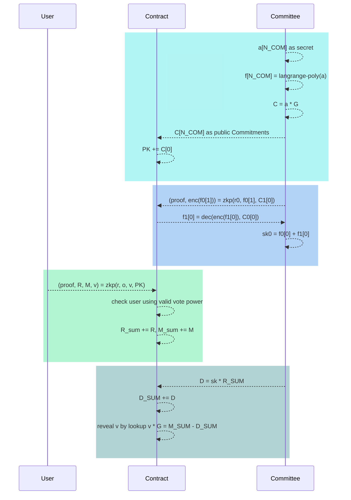

Impl the idea in https://hackmd.io/6ZFxxxnKT0iH-GJHUxKekw

# Workflow




# Setup
```shell
    % cd rust
    % wasm-pack build --target nodejs
    % rustup install nightly
    % rustup default nightly-2022-08-23-x86_64-apple-darwin
    % cargo t
    npx hardhat run scripts/nouns/nouns.ts 
```


# Estimation

A quick draft estimation on ZKP constraints and Gas Cost, Pls check whether it make sense to you.

Suppose n_com = 21, t = 10, and jubjub scalar_mul = ~1000

1. Round 2 have a larger but luckily 1-time constraints.
2. Pretty smaller ZKP for user voting.
3. Will profile posedion_enc later, guess affect less for Round 2.
4. ～200K fixed growth16 verification gas, 6K extra for each public input.
5. The estimation don't include basic circuit overhead(~6K) and contract decrypt/reveal logic cost.

|Stage| mul/xor/exp.| Scalar mul(jubjub). | posedion hash | Constraints | Public Input | Verify Gas |
| --- | ---- | --- | ---- | --- | --- | --- |
|  Round1|                 |    t   |              | 10 K| 2t | 320K |
|  Round2 | (n_com-1)*t | (n_com-1)*t|(n_com-1)*4  |200K+           | 2t+1 | 326K |
|  Voting  |                 |    5   |              |  5K | 10 |260K|
|  Tally   |                 |    1   |              | 1K | 4 |224K|

# Profile


# Refine Tips

1. no need ZKP in Round 1?

    ZKP(Round 1) only prove "the C points is on jubjub curve", which seems also been proved in Round 2

    Can be replaced by onchain "isOnCurve" instead.

2. Also have Same concern for the  tally ZKP

    suppose if 1 committee give wrong Di, there is no way to identify, and  reveal fail.

    doesn't provide any semantic for binding secret key.

3. Round2 Batch Proof of all the fi(l) in 1 transaction.

4. reveal lookup table design?

5. MPC Round 2 too heavy? do we really need all N*N 1->1 communication? maybe there are some easy way, like "map-reduce" style?

6. round2 r using a[i][j]? any security loss?

# Proof Aggregation

1. [groth16 circuit](https://0xparc.org/blog/groth16-recursion) ~20M constraints still too larger for browser, but it's ok for batch relayer.

2. round2 plonk zkey > 200MB, too big in browser ?

3. [snarkjs roadmap](https://blog.iden3.io/circom-snarkjs-plonk.html)
    - Custom constraints
    - Plookup
    - Recursive plonk

4. No circom plonk aggregation now.

5. Using Rust Plonk Aggregation:
    - [PSE maze](https://github.com/privacy-scaling-explorations/maze) supprot circom 2, need snarkjs setupmaze
    - [Matter-labs recursive_aggregation_circuit](https://github.com/matter-labs/recursive_aggregation_circuit) support circom 1

6. Using [Rust in Nodejs](https://fulcrum.rocks/blog/rust-tutorial)
    ```shell
        cd rust
        wasm-pack build --target nodejs
    ```

# Reference

1. [Baby Jubjub Library(Circom/js/sol)](https://eips.ethereum.org/EIPS/eip-2494)